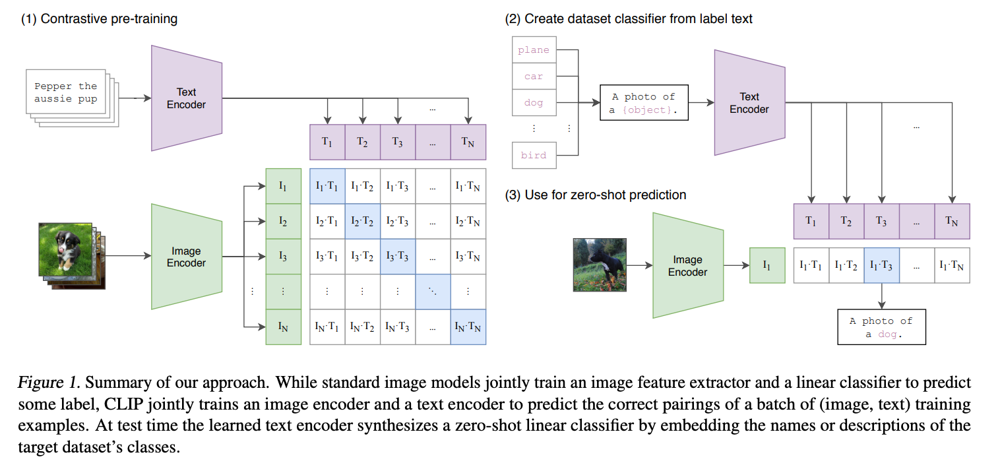
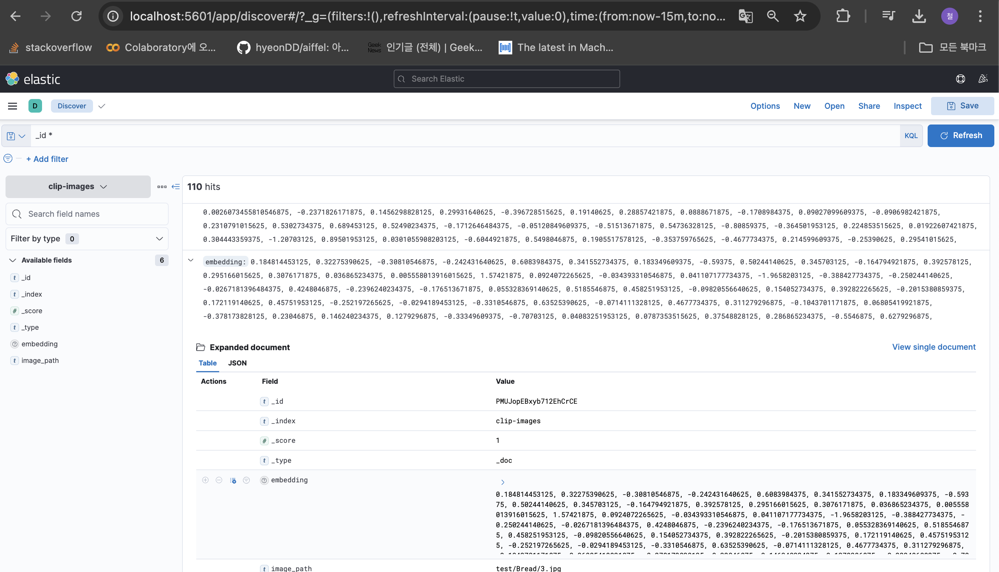
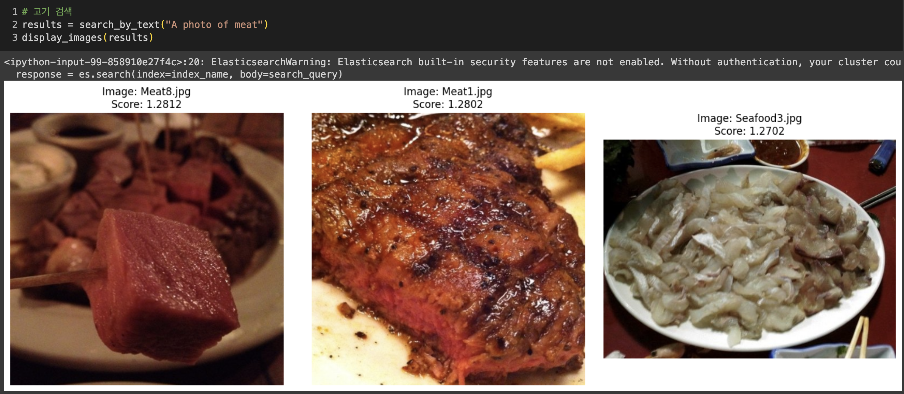
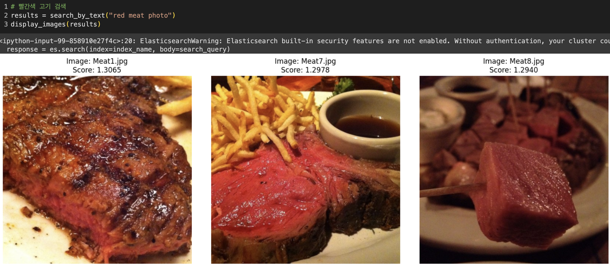
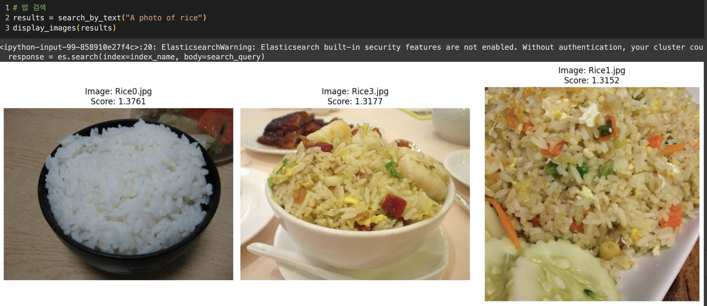
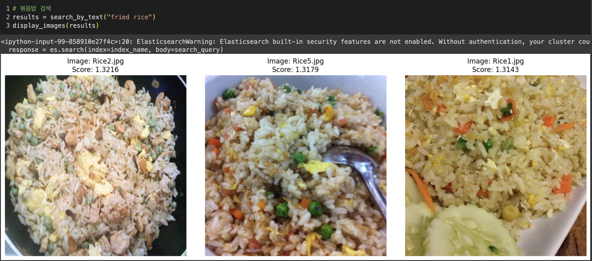

# clip-elasticsearch

clip 멀티모달을 활용한 이미지 검색



- Zero-Shot Learning
  - "텍스트"를 사용하여 이미지를 설명하여, 모델이 본 적 없는 클래스나 개념에 대해 추론이 가능함
  - ex) 모델은 고양이와 개 이미지만 학습했더라도, 학습 과정에서 본 적이 없는 "새" 이미지에 대해서도 적절한 예측이 가능.
    이는 모델이 고양이, 개, 새와 같은 클래스에 대한 개념을 학습하고, 이를 일반화하여 새로운 클래스를 처리할 수 있기 때문

### docker compose 실행

```sh
# docker network create
$ docker network create clip_multimodal

# docker compose
$ docker compose up -d --build
```

## ngrok proxy 서버 연결

[ngrok 공식문서](https://dashboard.ngrok.com/get-started/setup/macos)

mac os에서 진행

```sh
$ brew install ngrok/ngrok/ngrok
$ ngrok config add-authtoken {your authtoken}
$ ngrok http http://localhost:9200
```

위 명령어를 입력하면 url이 생성됨, 아래 notebook 파일 맨위의ELASTIC_URL 변수로 사용

## notebook 파일 (colab에서 진행)

[notebook 파일](https://github.com/hyeonDD/clip-elasticsearch/blob/main/clip_elasticsearch.ipynb)

### 결과

각 110장 사진의 임베딩된 벡터들









